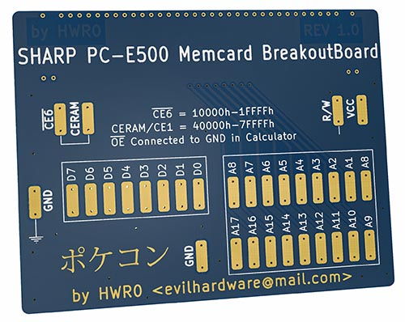
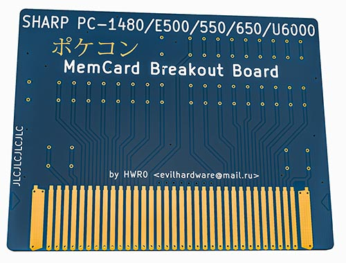
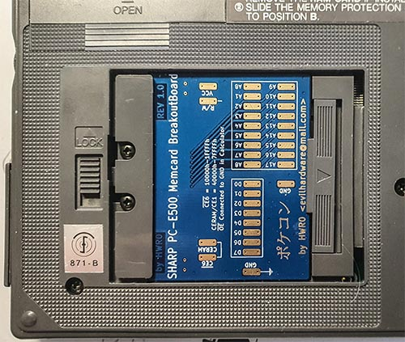

# Sharp PC-E500/550/600/650... Memory card breakout board
Breakout of all signals except NC, VCC2 (identical to VCC) and OE# which is tied to GND in the calculator 
grouped into Address and Data + Chip Enables +R/W

 No schema published as construction is straightforward (one signal = one pad).  
Pads are secured against delamination with two vias (pth). It is made to be used and reused! 
Fabrication recommendations: 1.6mm FR-4 and ENIG/ENEPIG finish (I do it usually for connectors and memory cards) 

Contact <a href="https://jlcpcb.com/">JLCPCB</a>,&nbsp;<a href="https://pcbway.com/">PCBWay</a>,&nbsp;<a href="https://oshpark.com/">OSHPark</a>
, or any other PCB fabrication company of your choice and send them the <a href="https://github.com/hwreverse/e500memcards/raw/main/MCBreakoutBoard/E500BBGerber.zip">Gerber files</a> with aforementioned instructions

