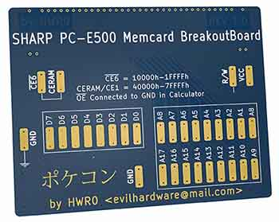

# Sharp PC-E500/550/600/650/U6000 Memory Cards (ポケコン)
Complete designs and production files (Gerber + Assembly) for Sharp PC-E500/550/600/650/U6000/PC-1360 Memory Cards.
Designs are mine and provided free of charge for a **non-commercial purpose** in an effort to push off people of the pocket computer market who gouge collectors with insane prices (Memory cards on Ebay available from 100-300€ !!!).       
For those who don't know how to do a PCB with the data provided, you can contact me at ***evilhardware(аt)mail.ru*** . I should have a small quantity of memory cards and breakout boards in stock for their production price with extremely low personal margins.

<a href="https://github.com/hwreverse/e500memcards/tree/main/MCBreakoutBoard"><b>
- Memory Card Breakout Board

  </b></a>
